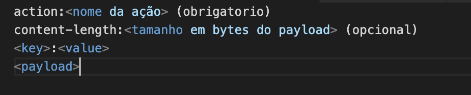

# trabalhoderede

Componentes da equipe: Rafael Pereira, Caroline Morais, Jeisiane Macedo, Bruno Junqueira

para rodar o programa primeiro inicie um servidor core:

`python3 core.py --port <porta do core>`

e pelo menos um servidor fs:

`python3 file_server.py --directory <diretorio> --port <porta do fs>`

# após ambos rodando, você pode fazer as requests de client como:

fazer upload determinando o numero de redundancias: 

`python3 client.py upload <ip do core>:<porta do core> --file <nome do arquivo> --redundancy <numero de redundancia>`

Alterar o número de redundancias:

`python3 client.py redundancy <ip do core>:<porta do core> --file <nome do arquivo> --redundancy <numero de redundancia>`

Fazer Download do arquivo:

`python3 client.py download  <ip do core>:<porta do core>  --file <nome do arquivo>`

# 

# Funcionamento:

O protocolo softp, funciona de maneira bem parecida com o HTTP apesar do que o nome sugere. como apresentado no video, há 3 programas, um "core" é um servidor que gerencia os arquivos e servidores de arquivos.

A semelhança entre o HTTP e o SOFTP é em partes, o header, e o fato de que é stateless. Para cada request, deve haver uma resposta.

O formato do pacote da camada de aplicação é:

o core mantem uma lista de quais servidores de arquivos tem um determinado arquivo, com essa informação pode decidir apagar ou enviar determinado arquivo a outros servidores.